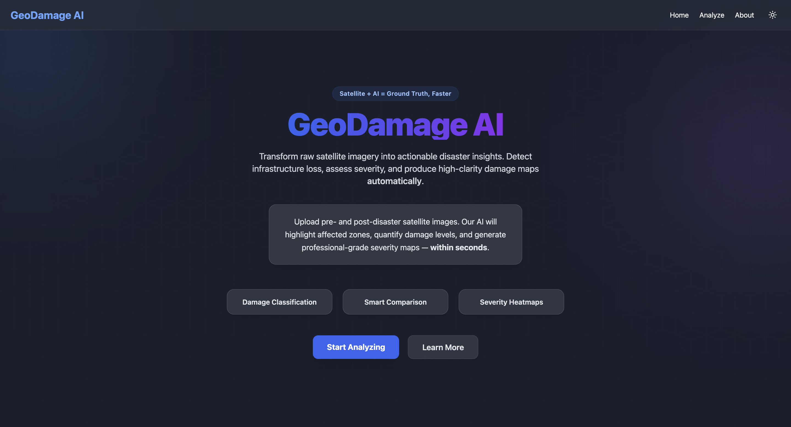
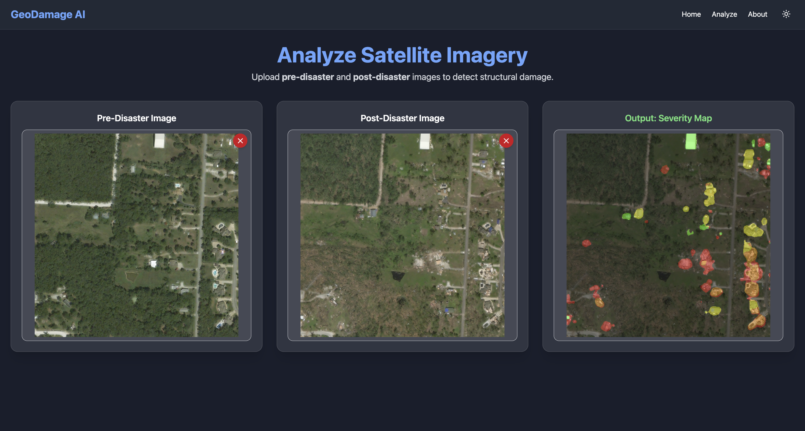

# GeoDamage AI

## Project Overview
GeoDamage AI is a web-based application for **automated disaster damage assessment** using
**pre-disaster and post-disaster satellite imagery**.  
The system combines a **Vite + React frontend** with a **FastAPI backend** powered by deep learning
to generate **pixel-level damage heatmaps**.

---

## 🔍 Features

- **Dual Image Analysis (Pre & Post Disaster)**  
  Upload pre-disaster and post-disaster satellite images for change-based damage assessment.

- **Transformer-Based Damage Segmentation**  
  Uses a **Vision Transformer (ViT) + U-Net** model to perform accurate, pixel-level damage detection.

- **Interactive Web Interface**  
  Clean and responsive frontend built with **Vite + React** for visualizing damage results.

---

## Setup Instructions

1. **Clone the repository**
   ```bash
   git clone https://github.com/Shreyashofficial05/GeoDamage-AI.git
   cd GeoDamage-AI
   ```

2. **Set up the backend (FastAPI)**
   ```bash
   cd backend
   pip install -r requirements.txt
   ```
   
3. **Run the backend server**
   ```bash
   python backend.py
   ```

4. **Set up the frontend (Vite + React)**
   ```bash
   cd frontend
   npm install
   ```

5. **Run the frontend**
   ```bash
   npm run dev
   ```

6. **Open the application**
   ```bash
   [npm run dev](http://localhost:5173)
   ```

---

## 📸 Screenshots

### 🏠 Home Page


### 📤 Upload Pre & Post Disaster Images and Analyze

